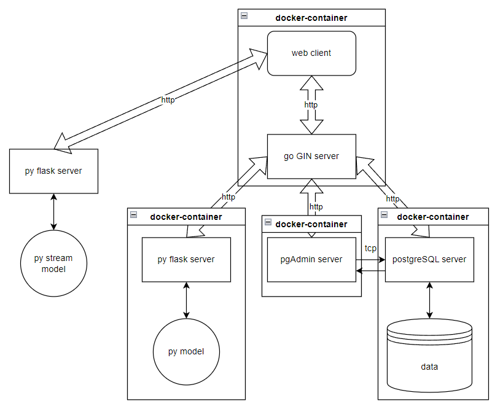

<div align="center">
  
# ЦИФРОВОЙ ПРОРЫВ: СЕЗОН ИИ <br> Компетентный подбор образовательных курсов


</div> 


## Оглавление
- ### [Задание](#1)
- ### [Решение](#2)
- ### [Запуск кода](#3)
- ### [Уникальность нашего решения](#4)
- ### [Стек](#5)
- ### [Команда](#6)
- ### [Ссылки](#7)

## <a name="1"> Задание </a>

Сегодня пользователям сложно ориентироваться в большом числе обучающих курсов на образовательных платформах, а также прорабатывать свою личную траекторию развития для получения необходимого уровня знаний, соответствующего желаемой профессии.

Необходимо разработать MVP на основе искусственного интеллекта, который сможет определить, какую программу обучения стоит изучить, чтобы приобрести необходимые навыки и знания для успешного трудоустройства. Решение должно анализировать требования, предъявляемые кандидатам в вакансиях, и предлагать персонализированные рекомендации образовательных курсов, продуктов или других обучающих материалов, соответствующих потребностям рынка труда.

## <a name="2">Решение </a>

### Архетиктура решения

<div align="center">


## <a name="3">Запуск кода </a>

### Последовательные шаги для запуска кода:
1. Склонируйте гит репозиторий;
```Bash
git clone https://github.com/BuldakovN/RRR-Video-Action-Classification.git
```
2. Скачайте веса для модели детекции https://drive.google.com/drive/folders/1iQRcneyDnb3q7LZ9wcGfkDt3W5zAKjwD?usp=sharing и разместите их в папках ```model/weights``` и ```modelStream/weights```

3. Запуск контейнеров и сервера стриминга:
```Bash
cd RRR-Video-Action-Classification
docker-compose build
docker-compose up

cd modelStream

pip3 install -r requirements.txt
python3 serverStream.py
```

## <a name="4">Уникальность нашего решения </a>

1. Возможность распознавания действий нескольких людей на одном кадре.

2. Работает в режиме реального времени.

3. Модель была предобучена на большом датасете.

4. Удобный веб-интерфейс для работы с моделью.

## <a name="5">Стек </a>
<div align="center">
  &nbsp;
  &nbsp;
  &nbsp;
  
  &nbsp;
  &nbsp;
  &nbsp;
  
</div>

## <a name="6">Команда </a>

*Состав команды "Герои ML и Тильта"*   

- <h4>: @Ubludor, Маслов Денис - Fullstack-developer</h3>
- <h4>: @Skadar7, Кузнецов Денис - ML-engineer</h3>
- <h4>: @Llaceyne, Гулария Лана - Designer, Frontend-developer</h3>
- <h4>: @vseesheoleg, Сивец Олег - ML-engineer</h3>

## <a name="7">Ссылки </a>

- [ссылка на веса модели детекции](https://drive.google.com/drive/folders/1iQRcneyDnb3q7LZ9wcGfkDt3W5zAKjwD?usp=sharing)&nbsp;
- [ссылка на скринкаст](https://drive.google.com/file/d/1Md4uNQFHtO_w9xxaigyc6ftbF0Tru6qk/view?usp=sharing)&nbsp;
